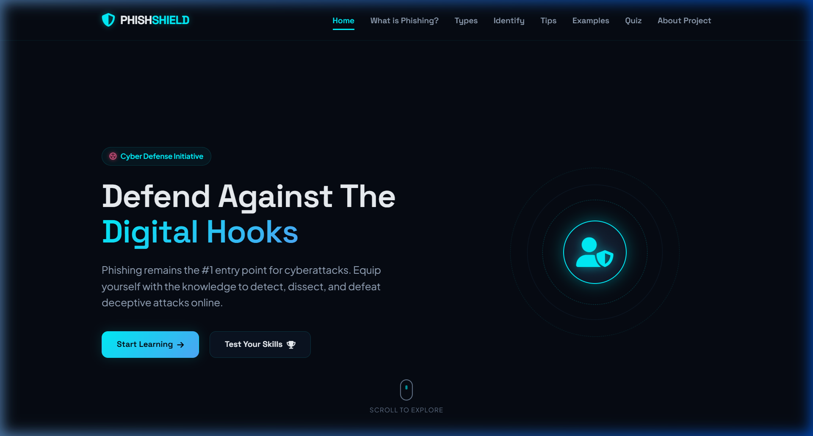
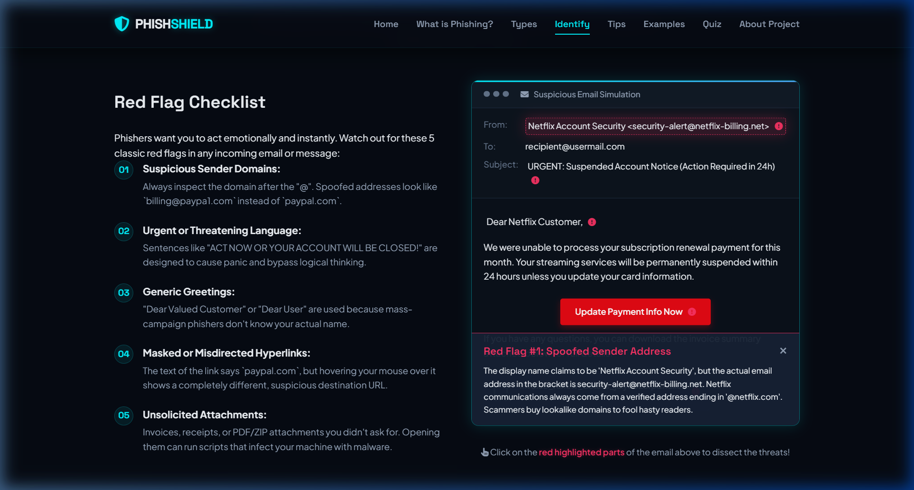
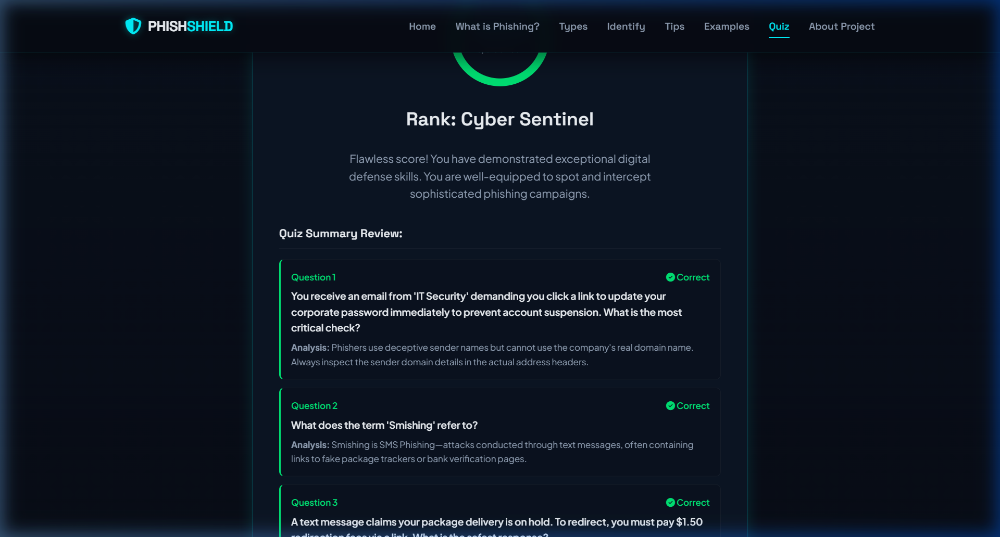

# PhishShield: Phishing Awareness & Cyber Defense Program

PhishShield is a modern, responsive, cybersecurity-themed educational web application designed to train individuals on identifying, analyzing, and defending against phishing attacks. Built as a virtual internship submission for CodSoft, this project serves as a comprehensive, beginner-friendly tool to foster cybersecurity vigilance and digital hygiene.

---

## 🚀 Features

- **Modern Cyberpunk UI**: A premium dark-themed interface built using deep space-blues, neon-cyans, warning-reds, and glowing accents.
- **Scrollspy Navigation**: A smooth-scrolling sticky navbar that dynamically updates menu highlights based on the active screen section.
- **Spot-the-Phish Interactive Simulator**: A hands-on visual email analyzer allowing users to click on critical components (sender domains, headers, salutations, attachments, hyperlinked buttons) to dissect threat markers instantly.
- **Educational Cards Grid**: Details four primary attack vectors: Email Phishing, Spear Phishing, Smishing (SMS), and Vishing (Voice).
- **Side-by-Side Case Scenarios**: Tabbed interactive comparisons displaying Legitimate vs. Phishing emails and texts side-by-side.
- **Cybersecurity Awareness Quiz**: A 5-question multiple-choice questionnaire with:
  - Responsive progress bars and dynamic trackers.
  - Immediate correct/incorrect feedback with visual color cues.
  - Comprehensive, interactive answers analysis.
  - Dynamic scorecards reporting performance ranks (e.g. *Cyber Sentinel*, *High Risk System*).
- **Fully Responsive**: Fluid, mobile-first design optimized for desktop monitors, tablets, and smartphones.

---

## 🛠️ Technologies Used

- **HTML5**: Semantic tags for structured, SEO-friendly layout representation.
- **CSS3 (Vanilla CSS)**: Advanced layouts (Flexbox, CSS Grid), custom animations, glassmorphism filters, active shadow glows, and custom media queries.
- **JavaScript (ES6)**: Vanilla DOM operations, scroll indicators, event listeners, and interactive scoring structures.
- **FontAwesome**: Modern vector iconography.
- **Google Fonts**: Custom typeface pairing (`Space Grotesk` headings and `Plus Jakarta Sans` body).

---

## 📂 Folder Structure

```text
PHISHING AWARENESS PROGRAM/
│
├── index.html
├── css/
│   └── style.css
├── js/
│   └── script.js
├── images/
│   ├── cyber_banner.png          (Cybersecurity banner graphic)
│   ├── hero_home.png             (Hero page screenshot)
│   ├── active_spot_the_phish.png (Spot-the-Phish simulator screenshot)
│   └── quiz_results.png          (Quiz results scorecard screenshot)
├── assets/
│   └── doc_references.txt        (Academic references and notes)
└── README.md
```

---

## 💻 How to Run the Project

Since this project is built entirely using frontend languages (HTML, CSS, JS) with no databases or backend APIs, it runs locally on any web browser without compilation or deployment servers:

1. **Clone or Download the Repository**:
   Download the project folder to your local machine.

2. **Open index.html**:
   Double-click the `index.html` file at the root directory to launch the application instantly in your default web browser (Chrome, Firefox, Safari, Edge, etc.).

3. **Alternative (VS Code Live Server)**:
   If using VS Code, right-click `index.html` and click **"Open with Live Server"** to host the page locally at `http://127.0.0.1:5500/`.

---

## 📸 Project Screenshots

Here are live screenshots captured directly during system verification:

### 1. Cyber-themed Hero Dashboard (Home)


### 2. Spot-the-Phish Simulator (Active State)


### 3. Assessment scorecard (Quiz Results)


---

## 🛡️ Internship Submissions Checklist

- [x] Responsive layout validation on both desktop and mobile viewports.
- [x] Functioning smooth-scrolling anchors.
- [x] Working mobile hamburger drawer toggle.
- [x] Zero script errors in the developer console.
- [x] Complete interactive quiz logic, score recalculations, and reset flows.
- [x] Clean, annotated, and formatted source code.
